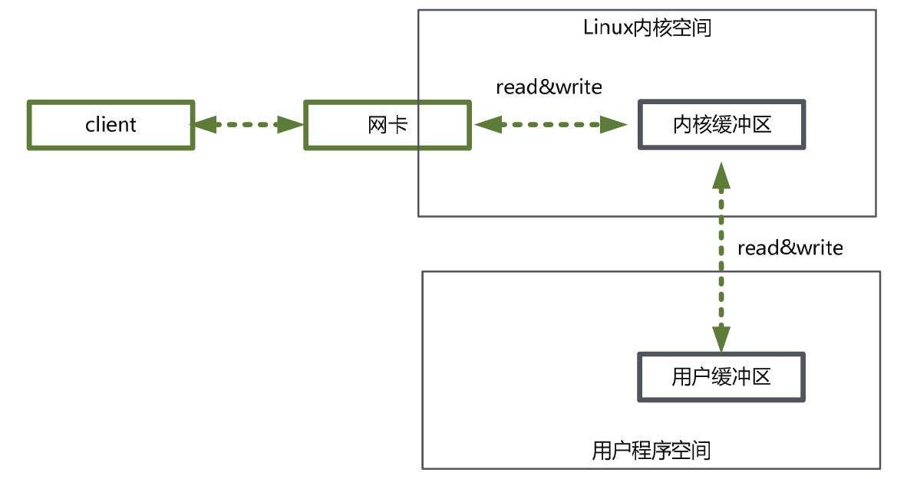

### 1.IO读写的基础原理

1.用户程序进行的IO读写，基本上是用到底层的read&write两大系统调用。

2.read系统调用不是直接从物理设备把数据读到内存，write也不是直接把数据写入到物理设备，用到了缓冲区

3.缓冲区分为内核缓冲区、进程缓冲区

4.read系统调用是把数据从内核缓冲区复制到进程缓冲区，write是把数据从进程缓冲区复制到内核缓冲区。

5.上层程序（java程序的Socket操作和文件IO操作、c++程序等）的IO操作实际上是缓存的复制，不负责数据在内核缓冲区和物理设备（磁盘）之间交互，底层的读写交换是由操作系统内核（Kernel）来完成。

###  2.内核缓冲区与进程缓冲区

1.设置缓冲区的目的是为了避免频繁的与设备之间的物理交换。

2.物理设备的交换设计到操作系统的中断，发生中断需要保存进程线程现场，结束中断后需要恢复，增加的底层系统的时间

、性能损耗。

3.底层操作会对内核进行监控，当缓冲区到达一定数量就会进行物理设备中断处理，什么时候中断由操作系统内核决定

###  3.系统调用流程

