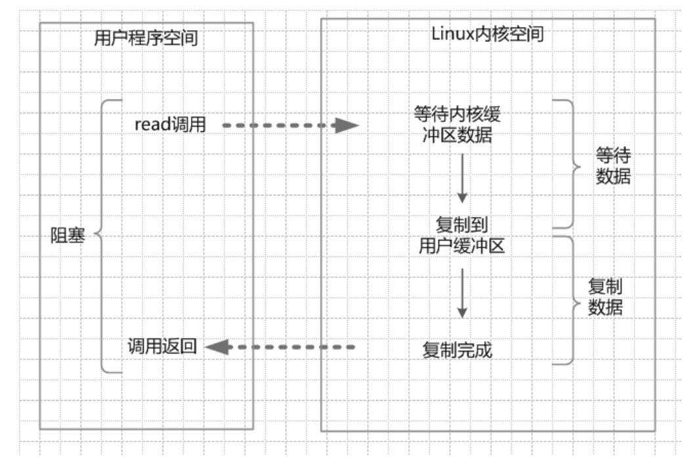

###  同步阻塞IO（Blocking IO）

1⃣️java中，默认的[socket连接](https://blog.csdn.net/qq_41165567/article/details/88965508)是同步阻塞IO。

2⃣️从IO系统调用开始，直到调用返回的这段时间，用户程序是阻塞的。

3⃣️系统内核收到read系统调用就会准备数据，准备完成就会保存到内存缓冲区，这个时候内核需要等待，系统就被阻塞。

4⃣️将内存缓存区复制到用户缓冲区之后，内核才会返回结果，系统这个时间阶段也会被阻塞。

5⃣️内核返回用户线程解除阻塞，才能处理其他业务。

6⃣️好处：1、开发简单 2、阻塞期间线程挂起，不会消耗cpu资源

7⃣️坏处：1、socket服务端如果阻塞，会导致所有的客户端读写阻塞，线程不结束都被挂起，虽然不消耗cpu但消耗大量内存

​				 2、socket服务端为每一个client请求分配一个线程，需要大量的线程来维护网络链接，这样线程的切换开销会很大，并且加入					   线程在同一个阻塞过多，会造成服务器直接内存爆满，进程被杀死。

###  同步非阻塞IO

1.通过设置将Socket变成非阻塞模式（No-Blocking）。

2.在内核缓冲区没有数据的情况下，系统会立刻返回，返回一个调用失败的信息。

3.在内核缓冲区有数据的时候是阻塞的，直到数据从内核缓冲区复制到用户进程缓冲区。

4.优点：每次发起的IO调用，在内核等待的过程中机会返回，用户线程不会阻塞

5.缺点：不断的轮训内核，这将占用大量的CPU时间，效率低下。

###  IO多路复用

1.避免同步非阻塞IO的轮训等待问题。

2.引入了一种新的系统调用，查询IO的就绪状态，在linux系统中对应的系统调用为select/epoll系统调用。

3.一个进程可以监视多个文件描述符，一旦某个描述符就绪，内核就能将就绪（指的是内核缓冲区可以读/可以写），内核能将就绪状态返回给应用程序。随后进行相应的IO系统调用。

4.调用举例：1.选择器注册，java中对应selector类，开启整个IO多路复用模型的轮训流程。

​					  2.就绪状态的轮训，通过系统的查询调用，内核会返回一个就绪的socket列表。

​					  3.用户线程（这里在server端）发起IO调用，开始阻塞，内核开始向用户缓冲区复制数据。

​					  4.复制完成。内核返回结果，用户线程解除阻塞状态。

5.IO多路复用建立在操作系统的基础设施上，即是操作系统的内核必须支持select/epoll。

6.IO多路复用模型与同步非阻塞IO模型有密切的关系，对于注册在选择器上的每一个可以查询的Socket都应该设置为同步非阻塞

~~~java
Selector selector = Selector.open();
    ServerSocketChannel serverSocketChannel = ServerSocketChannel.open();
    serverSocketChannel.socket().bind(new InetSocketAddress(port));
    serverSocketChannel.configureBlocking(false);
    serverSocketChannel.register(selector, SelectionKey.OP_ACCEPT);
 
    while (true) {
        int n = selector.select(); // Block
        Iterator<SelectionKey> it = selector.selectedKeys().iterator();
        while (it.hasNext()) {
            SelectionKey key = it.next();
            if (key.isAcceptable()) {
                ServerSocketChannel server = (ServerSocketChannel) key.channel();
                SocketChannel channel = server.accept();
                if (channel != null) {
                    channel.configureBlocking(false);
                    channel.register(selector, SelectionKey.OP_READ);
                    onAccept(channel);
                }
            }
            if (key.isReadable()) {
                SocketChannel socketChannel = (SocketChannel) key.channel();
                onRead(socketChannel);
            }
            it.remove();
        }
    }
~~~

​                   

